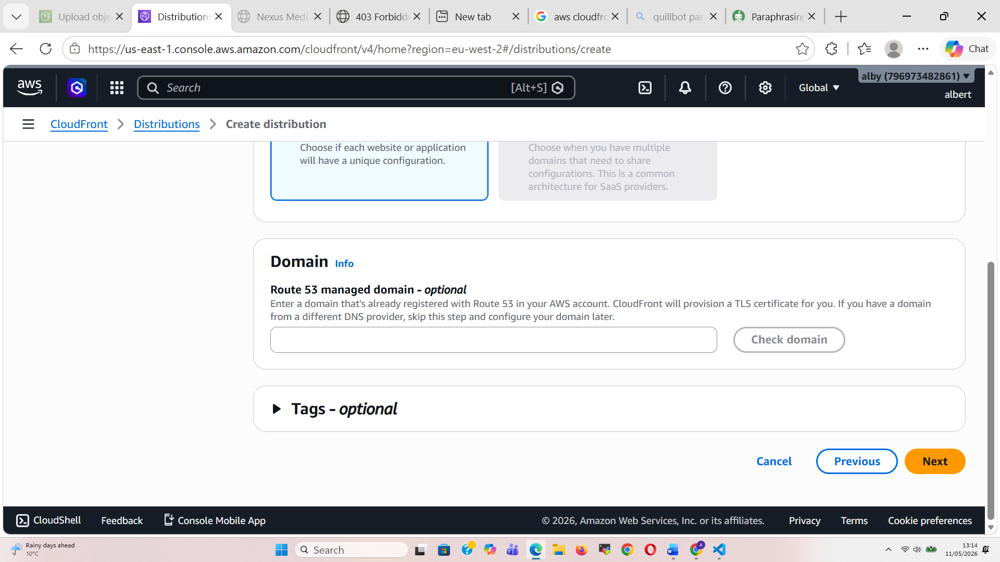

## Creating a static website   

Note:
Step 1:
##### Create aws account : 
- Log in into your “aws” account with your credentials.   https://console.aws.amazon.com/s3  
- Authenticate and choose your region.  

https://eu-west-2.console.aws.amazon.com/s3/get-started?region=eu-west-2
 

Step 2: Creating a bucket	In this section we see two separate accounts namespaces.
 

Global namespace allows your bucket name registered globally where no one can create the same name, meaning its unique across all aws account and region.
Bucket name also turns to be part of the endpoint URL.
Account regional namespace: buckets names are only registered or unique within specific region.
Step3 Choose a bucket name,
 
  scroll down  click create

After navigate to Properties.
 

Under Static website hosting click edit. 

	Enable (choose enable).
	As by default under S3 static website hosting shows disabled.
	 
	
	  Hosting type, Choose Host a static website.

Index Docurment.
Enter the file name of the index, index.html
 

= Click save changes.  

It is confirmed with the Bucket website endpoint at the bottom of the page.
http://quazi-africa.s3-website.eu-west-2.amazonaws.com

 

Copy the endpoint into a new browser and its results shows 403 Forbidden.
Step 4 Click on Permissions 
Edit Block all public access, clear public access and click save. Confirm to block all public access.
Step 5: Bucket Policy click on edit and paste a policy,
With the policy under the Resource, this should be the same name as the bucket name created earlier.
In the space provided as the policy editor, scroll down and click save changes. Policy has successfully been added.
If you error shows invalid, check bucket name Or policy syntax if there are no errors, also check Block Policy Access.
Step 5: Configure index.html
For static website hosting. Open Virtual Studio Code
Create an index.html file 
Save the index.html file locally and upload the index.html file into the console bucket list
Choose upload and click on add file.
Scroll down and click on upload to confirm the index.html file chosen.

Step 6. Test the website with the end point.
navigate to your bucket name example. Web-albert.
Choose Properties and scroll down to static website hosting, choose bucket website hosting.
http://web-albert.s3-website.eu-west-2.amazonaws.com
Copy and paste the endpoint into a browser / click on the endpoint, the index opens in a window.
Step 7 : Amazon CloudFront, a quick and safe content delivery network (CDN) service, Amazon CloudFront speeds up the distribution of websites, APIs, and video content to users all around the world.
Low Latency & High Speed: Reduces load times by distributing static and dynamic content globally via edge locations.
Create a CloudFront distribution.
Choose a free plan
Enter a distribution name, distribution type leave as Single website or app.
Click on NEXT.
Origin type:
Choose Amazon S3
S3 Origin domain, choose the website endpoint 
web-albert.s3-website.eu-west-2.amazonaws.com
Keep the Origin settings as default. Click Next
Under enable security we keep all values settings as default.
Click Next.
Next, Review and Create 
Scroll down to confirm create distribution.
This gives a distribution domain name and ID below
d26uu8y34qqkez.cloudfront.net
Distribution ID above gives .net 

 